## 🔄 Data Flow: Prompt → LLM → Tool → Anki

```mermaid
flowchart TD

    subgraph MCP Prompt
      P[anki-mcp-prompts.service.ts]
    end

    subgraph LLM
      LLMClient["llm.ts<br>(Ollama / OpenAI API)"]
    end

    subgraph MCP Tool
      T[anki-mcp-tools.service.ts]
    end

    subgraph Anki Layer
      ACService[anki-connect.service.ts]
      AC["AnkiConnect API<br>(Anki Desktop Plugin)"]
      Anki[📚 Anki Decks]
    end

    User[👤 User] -->|Requests new cards| P
    P -->|Generate structured JSON cards| LLMClient
    LLMClient -->|Return JSON schema| P
    P -->|Send structured data| T
    T -->|Create notes| ACService
    ACService -->|HTTP JSON-RPC| AC
    AC -->|Adds cards| Anki

```

---

### 🔎 Explanation of Flow

1. **User** asks MCP Prompt (e.g., *“Generate cards for burn, take, buy”*).
2. **`anki-mcp-prompts.service.ts`** formats this request into structured text + schema for the LLM.
3. **LLM (`llm.ts`)** generates strict JSON output conforming to `anki-card.schema.ts`.
4. The prompt service returns the JSON to the MCP client, which calls the **Tool**.
5. **`anki-mcp-tools.service.ts`** validates the JSON (via Zod) and passes it to AnkiConnect.
6. **`anki-connect.service.ts`** sends a JSON-RPC request (`addNotes`) to the **AnkiConnect API**.
7. AnkiConnect creates cards inside the appropriate **Anki deck**.
